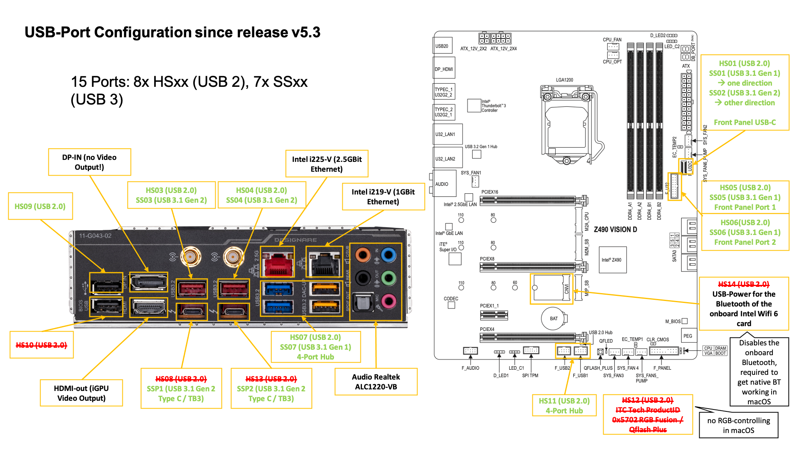

# Hackintosh-Intel-i9-10900k-Gigabyte-Z490-Vision-D

## USB Port Configuration

In this repo the current Port Configuration is that I use USBInjectAll.kext and I created my own SSDT-EC-USBX.aml and SSDT-UIAC.aml using Hackintool 3.4.0.

By default all the ports are enabled, except for the USB 2.0 port that is labeled "BIOS". (That Port is intended to be used to flash the BIOS.) I had to disable this BIOS port to stay within the 15 port USB limit. Moreover, I don't need this port as much as the faster ones. BIOS flashing will work anyways, because this is done prior the Bootloader config.

The current default port configuration works perfectly fine and so most people can likely skip reading the following sections if you don't want / need to make changes to the default Port Configuration.

However, the details are intesting and the following sections detail alternative Port Configurations and how to create your own if you are working with a different motherboard or are so inclined to make changes. 

### My USB-port configuration ###



### HowTo create your own USB-port configuration ###

If you want to use this EFI-folder for a different Z490 Board, you should create your own ```SSDT-UIAC.aml``` with Hackintool.

At the end of this configuration, Hackintool will generate a USBPorts.kext and a SSDT-UIAC.aml and SSDT-EC-USBX.dsl.

And then you should either use ```USBInjectAll.kext``` + ```SSDT-UIAC.aml``` + ```SSDT-EC-USBX.aml``` OR the ```USBPorts.kext``` only.

BTW: Most have different variations for the ```SSDT-EC-USBX.aml```. I guess most of the time ```SSDT-EC.aml``` and ```SSDT-EC-DESKTOP.aml``` have the same purpose. 

1. Before we start with the configuration you should use the ```USBInjectAll.kext``` without ```SSDT-UIAC.aml```. The ```SSDT-EC-USBX.aml``` should stay at this time, your system might become unbootable without the ```SDT-EC-USBX.aml```. But delete ```USBPorts.kext``` and ```SSDT-UIAC.aml```.

2. Open Hackintool and go to the USB-section. Normally you see much more than 15 entries here and also the Connector-column contains wrong definitions.

3. Press the broom-icon to clear the USB-port section and then the refresh icon. Your USB-port section should look similar to this and is showing much more ports than the allowed number of 15 and a wrong connector definition:


4. Depending on what ports you have, you should have a USB2, a USB3 and a USBC device. 

5. Now plug in the USB2 stick into all USB2/USB3 ports. Once connected the ports should be highlighted green in Hackintool. For all the green ones set the connector type to "USB2" first. Then plugin the USB3-stick into all USB2/USB3 ports. All ports, where you see your USB3-stick shown in the device column, should then be set to "USB3". So if you have a port that supports USB2 and USB3, you should set it to the higher standard, so "USB3". At last you plugin the USBC-stick into all the USBC-ports. Plug them in  both ways. If your stick appears at the same port in both direction, set it to "TypeC+SW". If two different ports show the device when you plug in the stick in both directions in the same port, set both to "TypeC".

6. Now you need to limit the number of ports/entries to 15. Thunderbolt-ports (eg. "SSP1" or "SSP2") don't count into the 15 port limit. So now you need to decide for yourself, which of the ports you don't need so much. E.g. I have deleted the USB2-port that is labeled "BIOS" because I prefer to keep a faster USB3 port over a USB2 port.

7. When you are done, your Hackintool should look like this:


8. Now click the export button. This will generate a ```USBPorts.kext```, a ```SSDT-EC-USBX.aml``` and a ```SSDT-UIAC.aml```. Now you either 
a) Use only the ```USBPorts.kext``` (and delete ```USBInjectall.kext```, ```SSDT-EC-USBX.aml``` and ```SSDT-UIAC.aml```)
Or
b) Use ```USBInjectall.kext``` + ```SSDT-EC-USBX.aml``` + ```SSDT-UIAC.aml```.

